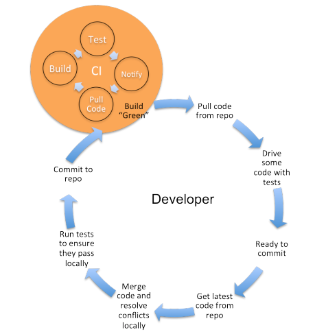
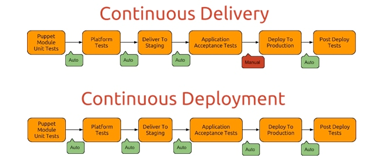

CI / CD
================================

# I. CI là viết tắt của Continuous Integration

  - Là tích hợp liên tục, nhằm liên tục tích hợp các source code của các members trong team lại một cách nhanh chóng, giúp kiểm soát được tình hình phát triển thông qua các bước kiểm thử (Integration test, regession test), nhằm đưa sản phẩm đạt đến sự ổn định.
  
  - Hình ảnh minh họa chu trình Continuous Integration (CI)

        
       
  - Chu trình làm việc với sources code:
  
    + Đầu tiên, các members trong team sẽ bắt đầu pull code mới nhất từ repo về branch để thực hiện các ticket nhất định.
  
    + Tiếp đó là quá trình typing và testing code để đảm bảo chất lượng ticket cũng như toàn bộ source code.
    
    + Members sẵn sàng cho việc commit vào branch phát triển của cả team.
    
    + Members cập nhật code mới từ repo về local repo
  
    + Merge code và giải quyết conflict.
  
    + Build và đảm bảo code pass qua các tests dưới local.
  
    + Commit code lên repo
  
    + Máy chủ CI lắng nghe các thay đổi code từ repository và có thể tự động build/test, sau đó đưa ra các thông báo (pass/failure) cho các members.

## II. Continuous Delivery hay Continuous Deployment ?

  - Trước hết Continuous Delivery: được hiểu là chuyển giao liên tục, là 1 tập hợp các kỹ thuật nhằm đảm bảo việc triển khai tích hợp souce code trên môi trường staging ( một môi trường rất giống với môi trường production). 
  Theo cách này ta có thể đảm bảo source được kiểm thử một cách tỉ mỉ trước khi deploy lên môi trường production. Khi đó source code sẽ không được deploy tự động sang môi trường production.
  
  - Continuous Deployment: là 1 bước phát triển của Coninuous Delivery, giúp hoàn tất giai đoạn chuyển khai từ môi trường staging ( môi trường kiểm thử) sang môi trường production. 
  Bằng cách này sources code sẽ đuợc tự động deploy lên môi trường production.
  
  - Vì vậy, ta sẽ hiểu CD là Continuous Delivery hay Continuous Deployment thì phụ thuộc vào cách thức mà nó triển khai trai trên môi trường production hay môi trường testing/staging
  
  - Sự khác nhau giữa Continuous Delivery vs Continuous Deployment được thể hiện dưới biểu đồ 
  
        