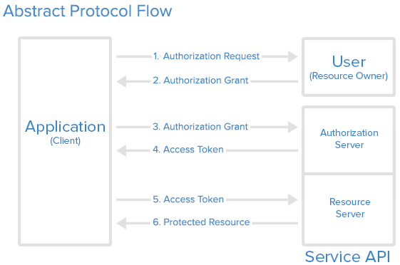
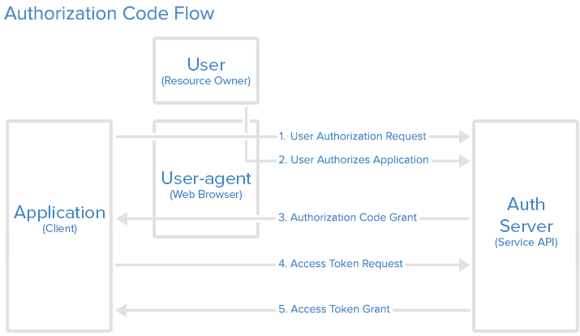
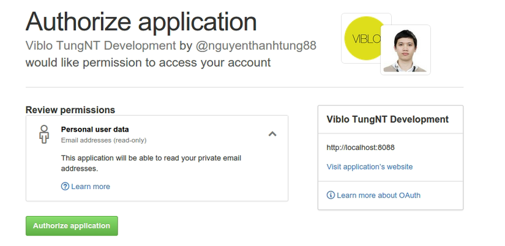
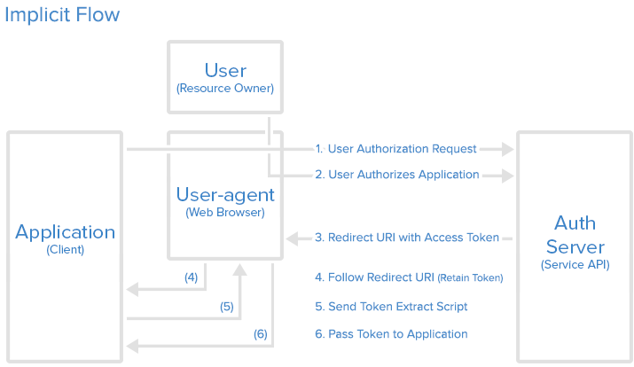

- OAuthen -> Spring boot -> SSO

- Ad:
 là gì
 hỗ trợ tính nằng gì
 SSO với AD hoạt động như nào
 Cấu hình AD (on premise)

Các khái niệm về chứng thực và xác lực
=========================================

# Mục lục
    
   - Authentication là gì ? 

   - Authorization là gì ?

   - Accounting (hay Auditing)

   - Open Authentication 2 (OAuthen 2) là gì ?
   
   - JWT là gì ?
  
   - SSO là gì ?

# I. Authentication là gì ?

   - Tạm dịch là xác thực, nó là quá trình kiểm tra danh tính của người dùng hoặc một hệ thống khác đến hệ thống hiện tại thông qua một hệ thống xác thực.

   - Một cách đơn giản quá trình Authentication là đi tìm câu trả lời cho câu hỏi `Bạn là ai?`

   - Quá trình này rất thông dụng trong hầu hết các `CMS` liên quan đến quản lý, tương tác người dùng thông qua form đăng ký (`login form`) và nó được xác thực dựa trên tên người dùng và mật khẩu (`password-based authentication`).

   - `Mật khẩu (Password & Pin)` : 
      
      + Mật khẩu là một trong những phương pháp đơn giãn và dễ triển khai nhất. Thường mỗi hệ thống sẽ lưu lại mật khẩu ở dạng đã được mã hóa một chiều (md5, sha1, tự chế…) để đảm bảo mật khẩu có bị lộ cũng không thể khôi phục thành chuỗi gốc.
   
   - `Khóa (Public-key cryptography)` :

      + Phương pháp này dựa trên thuật toán mã hóa khóa công cộng (`public key`) và khóa cá nhân (`private key`). Phương pháp này giúp cho người đăng nhập không cần nhớ thông tin gì về đăng nhập như phương pháp mật khẩu. Để đăng nhập vào hệ thống, bạn chỉ cần có khóa cá nhân (`private key`) trên máy và đăng nhập vào hệ thống (nếu đã khai báo với khóa công cộng của bạn). Cách này thường được áp dụng và bật với các hệ thống quản trị `server`

   - `Sinh học (Biometrics)` :

      + Đây là phương pháp dựa trên các yếu tố đặc trưng bởi người dùng như dấu vân tay, tròng mắt hoặc khuôn mặt. Phương pháp này có cái hay là bạn luôn `vác` cái `mật khẩu trời sinh` theo bên người mà không cần nhớ và chỉ dùng nó mỗi khi cần đăng nhập vào hệ thống.

      + Như vậy, có nhiều phương pháp để xác thực một tài khoản. Mỗi phương pháp đều có điểm mạnh nhưng cũng ẩn chứa những rủi ro khi triển khai như mất mật khẩu, mất khóa cá nhân, bị đánh cắp vân tay…
      
      - Nếu trên web, phương thức mật khẩu có vẻ là dễ triển khai và có nhiều lợi thế hơn vì thường thao tác trên màn hình và độ chính xác cao. Chúng ta có thể cải tiến hệ thống bảo mật hơn như theo dõi thói quen đăng nhập, địa điểm, IP, trình duyệt, mật khẩu một lần…

# II. Authorization là gì ? 

   - Một cách hiểu đơn giản quá trình Authorization là đi tìm câu trả lời cho câu hỏi `Bạn được phép làm gì?`

   - Xét về mặt logic thì authorization được thực thi sau khi `authentication` hoàn thành. 
   
   - Điều này có nghĩa là sau khi xác định được danh tính người dùng (authentication), hệ thống sẽ tiếp tục kiểm tra xem người dùng có thể làm gì trên tài nguyên (`url, tập tin, chức năng…`) của hệ thống hay còn gọi là phân quyền trên hệ thống.

   - Các hình thức phân quyền thường gặp là:

      + `Role-based authorization`: Phân quyền dựa trên vai trò của người dùng. Ví dụ trong WordPress có các role như là `Subscriber, Contributor, Author, Editor, Administrator` và mỗi một role sẽ có những quyền khác nhau và mỗi người dùng sẽ được phân role có quyền tương ứng. Đối với những hệ thống có nhiều người dùng thì role-based là cách tiếp cận tốt nhất để tiết kiệm thời gian trong việc phân quyền.

      + `Object-based authorization`: Phân quyền theo đối tượng. Cách này sẽ phân quyền cho từng đối tượng cụ thể. Ví dụ những đối tượng trong nhóm A, B được phân quyền chỉnh sửa các bài viết trong danh mục. Nhưng đối tượng trong nhóm A chỉ chỉnh sửa được bài viết trong danh mục C, đối trượng trong nhóm B chỉ chỉnh sửa bài viết trong danh mục D. 

# III. Accounting (hay Auditing)

   - Quá trình cuối cùng của hệ thống phân quyền gọi là `Accounting (hay còn gọi là Auditing)`, mình tạm dịch là kiểm tra hay ghi log. 
   
   - Quá trình kiểm tra là công đoạn ghi lại các hành động của người sau khi đã thực hiện một chức năng nào đó trong hệ thống.

# IV. Open Authentication 2 (OAuthen 2)

   - OAuth2 không đơn thuần chỉ là giao thức kết nối, nó là một "nền tảng" mà chúng ta phải triển khai ở cả hai phía: Client và Server. Sau đây hãy cùng làm quen với các tác nhân (hay đối tượng) tham gia vào hoạt động của OAuth2.

   - OAuth2 làm việc với 4 đối tượng mang những vai trò riêng:

     + `Resource Owner (User)`: Là những người dùng ủy quyền cho ứng dụng cho phép truy cập tài khoản của họ. Sau đó ứng dụng được phép truy cập vào những dữ liệu người dùng nhưng bị giới hạn bởi những phạm vi (scope) được cấp phép. (VD: chỉ đọc hay được quyền ghi dữ liệu) => chính là bạn.

     + `Client (Application)`: Là những ứng dụng mong muốn truy cập vào dữ liệu người dùng. Trước khi được phép tương tác với dữ liệu thì ứng dụng này phải qua bước ủy quyền của User, và phải được kiểm tra xác nhận thông qua API. => Có thể hiểu là các ứng dụng sử dụng `Facebook, Twitter, Google API` chẳng hạn.

     + `Resource Server (API)`: Nơi lưu trữ thông tin tài khoản của User và được bảo mật.

     + `Authorization Server (API)`: àm nhiệm vụ kiểm tra thông tin user (VD: ID), sau đó cấp quyền truy cập cho Application thông qua việc phát sinh `access token`.

     + `Resource Server` và `Authorization Server` chính là điểm khác biệt cơ bản giữa `OAuth2` và `OAuth1` khi tách biệt được hai thao tác: chứng thực (`Authorization`) và cung cấp thông tin người dùng (`Resource`) thành 2 Server.
   
# V. Tổng quan về Open Authentication ? 
### 1. Hoạt Hoạt động của OAuthenticaion 2

   > 

   - `Application` yêu cầu ủy quyền để truy cập vào Resource Server thông qua User
   
   - `Nếu User` ủy quyền cho yêu cầu trên, `Application` sẽ nhận được giấy ủy quyền từ phía `User` (dưới dạng một token string nào đó chẳng hạn)

   - `Application` gửi thông tin định danh (`ID`) của mình kèm theo giấy ủy quyền của User tới `Authorization Server`

   - Nếu thông tin định danh được xác thực và giấy ủy quyền hợp lệ, `Authorization Server` sẽ trả về cho `Application access_token`. Đến đây quá trình ủy quyền hoàn tất.
 
   - Để truy cập vào tài nguyên (`resource`) từ `Resource Server` và lấy thông tin, `Application` sẽ phải đưa ra `access_token` để xác thực.
  
   - Nếu `access_token` hợp lệ, `Resource Server` sẽ trả về dữ liệu của tài nguyên đã được yêu cầu cho `Application`.

   - Luồng hoạt động thực tế có thể sẽ khác nhau tùy thuộc vào việc ứng dụng sử dụng loại ủy quyền (`authorization grant type`) nào, trên đây chỉ là ý tưởng chung để thực hiện.

### 2. Đăng ký thông tin cho ứng dụng

   - Trước khi sử dụng Oauth cho ứng dụng, bạn phải đăng ký ứng dụng với bên cung cấp dịch vụ, một số thông tin cơ bản cần đăng ký như sau:

     + Tên ứng dụng (`Application Name`)
     
     + Website của ứng dụng (`Application Website`)
     
     + `Redirect URI` hoặc `Callback URL`: chính là địa chỉ sẽ quay về sau khi quá trình ủy quyền hoàn tất (cho phép hoặc từ chối từ phía User), chính vì thế mà địa chỉ quay về đó chính là nơi bạn sẽ phải thực hiện xử lý cho `authorization codes` hoặc `access tokens`.

   - `Client ID và Client Secret` là gì?

      + Khi ứng dụng của bạn được đăng ký, bên dịch vụ sẽ phát hành `thông tin chứng thực client (client credentials)` cho bạn bao gồm thông tin:

      + `Client Identifier`: là một chuỗi ký tự được sử dụng bởi `Service API` để định danh ứng dụng, đồng thời cũng được dùng để xây dựng `authorization URL` hiển thị phía User.

      + `Client Secret`: là một chuỗi ký tự được sử dụng để xác thực định danh (ID) của ứng dụng khi ứng dụng yêu cầu truy cập thông tin tài khoản của User. Chuỗi này được giữ bí mật giữa `Application và API`.


### 3. Authorization Grant

   - Như luồng hoạt động đã mô tả ở trên thì 4 bước đầu tiên làm nhiệm vụ chính là lấy ủy quyền (authorization grant) và access token. Loại ủy quyền phụ thuộc vào phương thức mà Application sử dụng để yêu cầu ủy quyền, Oauth2 định nghĩa ra 4 loại:

      + Authorization Code: sử dụng với các server-side Application.
      
      + Implicit: sử dụng với các Mobile App (ứng dụng chạy trên thiết bị của User) hoặc Web App (có thể hiểu là Browser App cũng được, VD: Chrome Extension).
      
      + Resource Owner Password Credentials: sử dụng với các Trusted Application, kiểu như những ứng dụng của chính 
      Service.
      
      + Client Credentials: sử dụng với các ứng dụng truy cập thông qua API.

   - Authorization Code:
     
      + Đây là một hình thức ủy quyền được dùng phổ biến nhất hiện nay, sơ đồ hoạt động như sau:

      > 

      + Yêu cầu authorization_code:
        
         - Đầu tiên Application sẽ gửi User link đến nơi để bắt đầu quá trình nhận authorization_code. Ví dụ:

           `https://OAUTH_SERVER.DOMAIN/oauth/authorize?response_type=code&client_id=CLIENT_ID&redirect_uri=CALLBACK_URL&scope=read`
         
           - Trong đó:
           
              -  `OAUTH_SERVER.DOMAIN/login/oauth/authorize`: API Authorization Endpoint.

              -  `client_id=CLIENT_ID`: `Client ID` của Application sau khi đăng ký với Service.

              - `redirect_uri=CALLBACK_URL`: Nơi quay về sau khi sinh ra authorization_code.

              - `response_type=code`: tham số để hiểu được ứng dụng đang yêu cầu nhận `authorization_code`.

              -  `scope=read`: định nghĩa phạm vi cho phép Application truy cập.

     + `User ủy quyền` cho Application:

         - Khi User click vào link, việc đầu tiên cần làm là User đăng nhập để định danh người dùng. Sau đó User sẽ được dẫn đến màn hình để Cho phép hoặc Từ chối Application truy cập các thông tin của mình. Dưới đây là một ví dụ cụ thể về màn hình này: 

              > 

     +  `Application` nhận `authorization_code`

          - Nếu User click vào Authorize application, bên cung cấp dịch vụ sẽ chuyển hướng người dùng đến Application redirect URI (đã được đăng ký từ trước đó), tại đây Application sẽ phải thực hiện thao tác lưu lại authorization_code. Ví dụ:

             - `https://APPLICATION.DOMAIN/callback?code=AUTHORIZATION_CODE`

     + `Application` yêu cầu `access_token`

         - Sau khi nhận được authorization_code, Application cần thực hiện Request lên Oauth Server một lần nữa để lấy được access_token. Việc này phải được Application đảm nhận và User không cần thao tác thêm gì nữa. Link request có định dạng như sau:

             - `https://OAUTH_SERVER.DOMAIN/oauth/token?client_id=CLIENT_ID&client_secret=CLIENT_SECRET&grant_type=authorization_code&code=AUTHORIZATION_CODE&redirect_uri=CALLBACK_URL`
     
     + `Application` nhận `access_token`

         - Nếu quá trình ủy quyền (`authorization`) thành công, phía API sẽ gửi thông tin trả lời dưới dạng JSON chứa `access_token` (hoặc có thể kèm theo cả `refesh_token`) tới Application. Dữ liệu trả về có dạng như sau:

            ```json

            {
                "access_token":"ACCESS_TOKEN",
                "token_type":"bearer",
                "expires_in":2592000,
                "refresh_token":"REFRESH_TOKEN",
                "scope":"read",
                "uid":966996,
                "info":
                    {
                    "name":"Tungshooter",
                    "email":"tungshooter@socool.com"
                    }
                }
            ```

         - Tới đây Application đã được User ủy quyền truy cập. Application có thể sử dụng `access_token` để truy cập những tài nguyên của dịch vụ mà User cho phép, ví dụ thông tin email, ảnh avatar, ... cho tới khi `access_token` hết hạn sử dụng. Nếu phía API hỗ trợ và gửi về thêm cả thông tin `refresh_token` thì Application có thể sử dụng để đổi lấy `access_token` mới khi `access_token` cũ hết hạn.

   - `Grant Type`: `Implicit`

      + Loại ủy quyền này thường được sử dụng cho các ứng dụng di động hay cái ứng dụng chạy trên trình duyệt (`VD: Chrome Extension`). Được coi như một `redirection-based` flow, trong đó `access_token` được đưa đến Application thông qua trình duyệt (`Browser`). Bởi vậy phương thức ủy quyền này không thực hiện xác thực ID của Application mà tin tưởng hoàn toàn vào redirect URI (được đăng ký với Service).

      + Loại ủy quyền này không hỗ trợ `refresh_token`.

      + Ta có thể hiểu đơn giản luồng hoạt động như sau: User nhận được yêu cầu ủy quyền cho Application, sau đó `Authorization Server` truyền thẳng `access_token` tới Browser và sau đó truyền lại cho `Application`. Sơ đồ hoạt động như sau: 

        > 

      + Implicit Authorization Link:

        - Cũng giống như phương thức ủy quyền trước đó, User sẽ được đưa tới một link để yêu cầu access_token từ API. Định dạng link như sau:
            