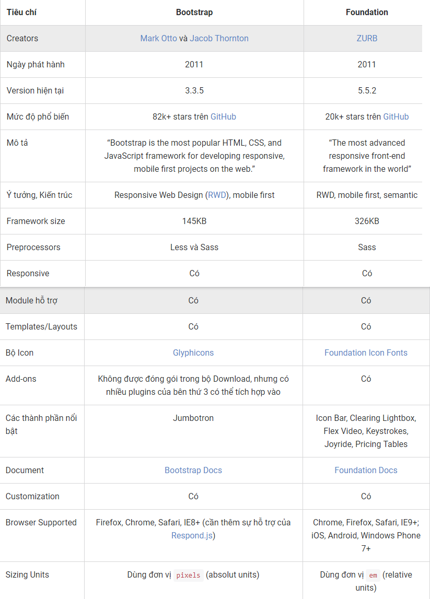
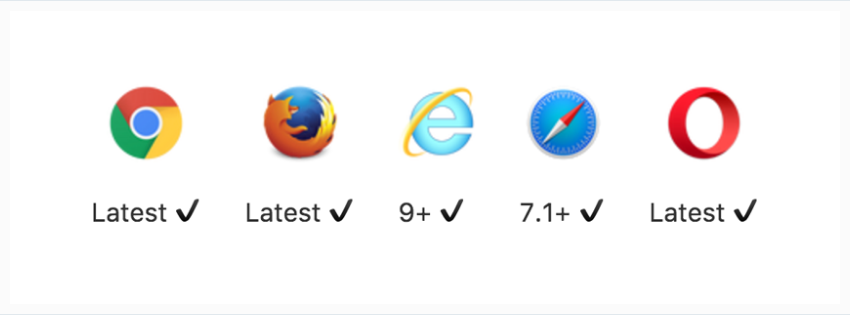

Chương 2: CSS
====================

# Mục lục

  - I. CSS là gì

  - II. Tác dụng của CSS

  - III. Quá trình phát triển

  - IV. Các framework của css và ví dụ

    - Boostrap

    - Foundation

    - Bulma

    - Ulkit

    - Semantic UI

    - Materialize css 

  - V. Responsive

  - VI. Kế nhiệm

    - SASS

    - LESS

    - SCSS

    - Stylus

    - PostCSS
  
  - VII. Phương pháp, mô hình

    + SuitCSS

    + OOCSS

    + Bem

    + SMaCSS

    + Systematic CSS

  - VIII. CSS 3

    + Flexbox

    + Gradients

    + Grids

    + Rotate

    + Transform

    + Skew

    + Scale

    + Transition

# 1: CSS là gì ?

  - CSS là chữ viết tắt của Cascading Style Sheets, nó là một ngôn ngữ được sử dụng để tìm và định dạng lại các phần tử được tạo ra bởi các ngôn ngữ đánh dấu (ví dụ như HTML). 
  
  - Phương thức hoạt động của CSS là nó sẽ tìm dựa vào các vùng chọn, vùng chọn có thể là tên một thẻ HTML, tên một ID, class hay nhiều kiểu khác. Sau đó là nó sẽ áp dụng các thuộc tính cần thay đổi lên vùng chọn đó.

# 2. Tác dụng của CSS ?
  
  - Bạn có thể hiểu đơn giản rằng, nếu HTML đóng vai trò định dạng các phần tử trên website như việc tạo ra các đoạn văn bản, các tiêu đề, bảng,…thì CSS sẽ giúp chúng ta có thể thêm một chút “phong cách” vào các phần tử HTML đó như đổi màu sắc trang, đổi màu chữ, thay đổi cấu trúc,…rất nhiều.

# 3. Quá trình phát triển của CSS
  
  - Css liên tục cập nhật gồm nhiều phiên bản. Mỗi phiên bản là 1 framework.

  - Các phiên bản của CSS bao gồm: 

    + CSS 1:  
      
      - Được xuất bản vào ngày 17 tháng 12 năm 1996

      - Các tính năng:

        + Kiểu chữ như in đậm, phong chữ

        + Màu chữ, hình nền

        + Các thuộc tính văn bản như khoảng cách giữa các từ, chữ cái và dòng văn bản

        + Căn chỉnh văn bản, hình ảnh, bảng và các yếu tố khác

        + Lề, đường viền, phần đệm và vị trí cho hầu hết các phần tử

        + Nhận dạng duy nhất và phân loại chung các nhóm thuộc tính

    + CSS 2:

      - Đặc tả CSS 2 được phát triển bởi W3C và được công bố như là một khuyến nghị vào tháng 5 năm 1998. 
      
      - Một phần lớn CSS 1, CSS 2 bao gồm một số khả năng mới như định vị tuyệt đối, tương đối và cố định của các phần tử và  z-index. 
      
      - Các loại phương tiện truyền thông, hỗ trợ cho các bảng định kiểu âm thanh (sau này được thay thế bằng mô-đun giọng nói CSS 3) và văn bản hai chiều và các thuộc tính phông chữ mới.

    + CSS 3:

      - Vậy CSS3 là một chuẩn mới nhất của CSS, hay nói cách khác nó là một Version mới của CSS. Nó được chia ra làm nhiều module và mỗi module sẽ có những nhiệm vụ khác nhau, khi 
      kết hợp chúng với nhau sẽ tạo nên những hiệu ứng tuyệt vời.

      - Với CSS3 nếu bạn kết hợp với jQuery nữa thì website của bạn sẽ trở nên sinh động, điển hình là các hiệu ứng Paralax, Landing Page, ...
      

# 4. Các framework của CSS

  - 4.1. Bootstrap: 
    
    + a. Khái quát:
    
        + Đây là 1 framework hỗ trợ thiết kế giao diện rất tốt. 
        
        + Phiên bản hiện tại là bootstrap 4.
        
        + Bootstrap được sinh ra tại Twitter hồi đầu có tên là Twitter Bootstrap hiện nay là FrameWork số 01, dễ dùng phổ biến và đầy đủ
        
        + Đây là FrameWork bạn nên chọn vì được khá nhiều đơn đặt hàng từ các trang FreeLancer trên thế giới.
        
        + Giao diện sẽ được xây dựng dể dàng nhờ vào bootstrap
        
    + b. Các vấn đề cần chú ý về bootstrap:
        
        + Tính năng Responsive: Mặc đinh, Bootstrap sẽ tự động thay đổi các trang của bạn cho phù hợp với các kích thước màn hình khác nhau. Tuy nhiên
        bạn có thể vô hiệu hóa nó
        
        + Hỗ trợ nhiều trình duyệt và thiết bị: 
            
            - Bootstrap được xây dựng để hoạt động ổn định nhất với các trình duyệt mới nhất trên máy tính để bàn và các thiết bị di động, điều đó có nghĩa 
            là các trình duyệt cũ có thể hiển thị các style khác đi mặc dù vẫn có đầy đủ chức năng khi các thành phần được tạo ra.
        
        + Hỗ trợ bên thứ ba:
        
            - Mặc dù chúng tôi không hỗ trợ bất kỳ plugin hoặc add-on nào của bên thứ 3 một cách chính thức, chúng tôi vẫn có một vài lời khuyên 
            hỗ trợ bạn tránh khỏi các lỗi tiềm tàng trong các dự án của bạn.
            
        + Vấn đề truy nhập:
            
            - Bootstrap được xây dựng tuân theo các chuẩn Web nói chung và—với một ít nỗ lực—có thể được sử dụng để tạo ra các site mà có thể truy cập được bằng cách sử dụng AT.
            
    + c. Cài đặt bootstrap:
    
        + CDN: Các bạn có thể dùng google CDN để chèn boostrap vào dự án của mình
        
        + Tải thư viện tại getbootstrap.com
        
    + d. Các component và các tính năng về JS: Xem tại getbootstrap.com
    
  - 4.2. Foundation
  
    - a. Foundation là gì ?
    
       + Foundation (theo như quảng cáo trên trang của họ) là một front-end framework đầu tiên và tiên tiến nhất thế giới, giúp chúng ta dễ dàng xây dựng các bản prototype, 
       các sites và các ứng dụng (apps) hoạt động trên hầu hết các thiết bị (từ các màn hình loại nhỏ như smartphone tới các màn hình cỡ trung và lớn như PC và TV) với bộ 
       thư viện mà họ cung cấp.
    
       + Foundation hướng tới kiến trúc mobile-first, tức là ban đầu bạn sẽ phải thiết kế ứng dụng cho các thiết bị có màn hình nhỏ đầu tiên, sau đó mở rộng ra những loại 
       kích cỡ màn hình lớn hơn. Tuy nhiên bạn cũng không bắt buộc phải đi theo kiến trúc đó, chỉ là họ khuyên nên làm theo kiến trúc này sẽ đạt được hiệu quả tốt về thiết kế.
    
    - b. Front-end framework là gì?
    
       + Tương tự như các frameworks dùng để xây dựng giao diện ứng dụng native (kiểu Xcode cho iOS), Foundation là một framework để xây dựng giao diện front-end, 
       giao diện người dùng của website hoặc các ứng dụng web. Foundation hoạt động trên browser, bởi vậy chúng ta có thể chủ động thiết kế các View riêng lẻ mà không 
       cần quan tâm đến vấn đề logic, hay Server xử lý ra sao.
    
    - c. Các kỹ thuật sử dụng trong Foundation:
    
       + Foundation được xây dựng và đóng gói với bộ HTML, CSS và Javascript, cung cấp cho người dùng các thành phần cơ bản nhất của ứng dụng Web.
       Ngoài ra các kỹ thuật như jQuery, HTML5 Boilerplate và Normalizr cũng được sử dụng để hỗ trợ thêm sức mạnh cho Foundation.
         
       + Kết hợp lại chúng ta sẽ có một bộ thư viện gồm các thành phần (components) và các plugins giúp làm việc dễ dàng hơn với các loại trình duyệt (browsers) và các loại thiết bị (devices) khác nhau.
    
    - d. Vì sao nên sử dụng Foundation
    
       + Foundation được phát triển và hỗ trợ bởi ZURB - công ty sử dụng framework này cho hầu hết các dự án của họ từ những startup nhỏ tới các doanh nghiệp lớn. 
       Foundation đã được dùng và kiểm thử trong nhiều năm.
       
       + Hiện tại Foundation đã ra phiên bản 5 và nhiều lần release với những cải tiến đáng kể để chắc chắn rằng nó có thể hoạt động tốt và tương thích với nhiều môi trường khác nhau.
    
    - e. Cài đặt:
    
       + Với 3 lựa chọn:
         
         - Download Everything - Trọn bộ framework (gồm các components và plugins).
        
         - Download Essentials - Light version của framework bao gồm các thành phần: grid, typography, interchange, buttons và Reveal.
        
         - Custom Download - Tùy chọn những thành phần muốn tích hợp vào hệ thống, đồng thời có thể chủ động định nghĩa màu sắc (color), độ rộng cột (column size) hay font size, ...
    
    - f. So sánh Foundation và Bootstrap
     
         
         
    
  - 4.3. Bulma
  
    - Bulma là một open source (mã nguồn mở) và framework miễn phí rất tốt về mặt tiết kiệm thời gian, công sức và ngày càng trở nên phổ biến, bởi nó rất đơn giản để học và sử dụng.
    
    - Thứ nhất, Bulma chứa các UI component tuyệt vời như tab, navigation bar (thanh điều hướng), box, panel và hơn thế, framework này được thiết kế để cung cấp cho bạn một giao diện người dùng rõ ràng và hấp dẫn. 
    
    - Thứ hai, Bulma cực kỳ đơn giản, bạn chỉ cần nhập vào những tính năng cần thiết để có thể bắt đầu công việc của mình. 
    
    - Cuối cùng, framework này có các class dễ đọc, một lợi thế rất lớn cho một số nhà phát triển. 
    
  - 4.4. Ulkit
    
    - Trong khi Bootstrap và Foundation có thể là hai framework cho front-end phổ biến nhất đối với các nhà thiết kế web, tuy nhiên trong bài viết này tôi sẽ giới thiệu 
    với bạn các tính năng của UIkit, một framwork nhẹ và có tính mô-đun cho fron-end cái mà tôi sử dụng trong hầu hết các dự án của tôi.
    
    - Tuỳ biến UIkit:
        
      + Đây là framework có thể được tuỳ biến một cách đầy đủ. Trước khi tải về, chúng ta có thể ghi đè lên các style mặc định của nó và áp dụng các style riêng của chúng ta. 
      
      + Ví dụ, nếu chúng ta muốn thay đổi các breakpoint (điểm ngắt) mặc định, chúng ta có thể truy cập vào trang customizer và tích vào tùy chọn Advanced Mode. 
      
      + Từ đó, chúng ta tìm thấy điểm các phần Breakpoint và thêm các breakpoint mới của chúng ta. Sau đó, chúng ta có được file CSS mới được tạo
      
    - Trình duyệt hỗ trợ:
        
         
         
    - Các tính năng hữu ích của UIkit:
    
      + Flexbox và Grids
      
      + Tạo hiệu ứng động dựa trên việc cuộn trang
      
      + Thao tác với SVG
      
      + Hình nền với kích thước tự động đáp ứng (responsive)
      
      + Tạo các lớp che phủ
      
      + Tạo trình chiếu hình ảnh toàn màn hình có khả năng đáp ứng (responsive)
      
      + Tạo tiêu đề cố định
      
  - 4.5. Semantic UI
  
    - Hiện nay, Bootstrap và Foundation là hai front-end framework được các lập trình viên web sử dụng nhiều nhất. Nhưng lịch sử luôn cho thấy rằng sẽ luôn có một thứ tốt hơn 
    sẽ xuất hiện và thay thế tất cả. Và điều đó sẽ không còn xa vời sự xuất hiện của Semantic UI, một modern front-end development framework.
      
    - Semantic UI được dựng trên LESS và jQuery. Mục tiêu của framework là cho phép designer và developer có khả năng chia sẻ UI thông qua 1 ngôn ngữ chung. 
      
    - Điều đó được thể hiện qua cách sử dụng ngôn ngữ mô tả để đặt tên cho các lớp và các quy chuẩn thay thế cho việc sử dụng các từ viết tắt ở các framework khác. 
    
    - Yếu tố này khiến cho Semantic UI gần gũi hơn với cộng đồng sử dụng tiếng anh. Ngoải ra còn phải kể đến một điểm cộng nữa của Semantic UI, nó được thiết kế phẳng với kiểu dáng đẹp, 
    tinh tế mang lại cho người dùng cảm giác gọn nhẹ đúng với xu hướng thiết kế hiện đại ngày nay.
    
    - Các tính năng:
    
      + UI Element là một khối dựng cơ bản. Nó có thể xuất hiện một mình hay một nhóm thống nhất. Ví dụ như 1 button đọc lập hoặc một nhóm các button.
      + UI Collection là một nhóm các loại thuộc tính khác nhau có sự liên kết. Ví dụ 1 form có thể có các button, input, checkbox, icon ...
      + UI View là đại diện cho một phần của nội dung website. Ví dụ như feed hoặc comment.
      + UI Module là thành phần tương tác với các chức năng dựa trên JavaScript. Ví dụ accordion, dimmer, modal ...
      + UI Behavior là môt thành phần không thể tồn tại độc lập, nhưng thay vào đó nó được sử dụng để them các chức năng vào các thành phần khác. Ví dụ, form validation cung cấp chức năng xác nhận cho form.
      
    - Hầu hết các thành phần đều có type, state và variation. Ví dụ, loại của button bao gồm: nút cơ bản, nút với icon, nút có hiệu ứng, hoặc nút có thể được active, disabled, hay đang ở trạng tháng loading. 
    Hơn nữa, 1 nút có thể thay đổi kích thước, màu sắc và có thể dịnh dạng như basic, social, fluid, toggle ...
    
    - Semantic UI không những sử dụng các từ có ý nghĩa và cấu trúc tốt để đặt tên lớp, mà còn sử dụng chúng trong việc đặt tên, xác định và mô tả cho các thành phần của nó. 
    Việc này được thấy nhiều hơn so với Bootstrap hay Foundation.
    
    - Điểm đăc biệt thứ hai về Semantic UI là nó cung cấp một số tính năng và thành phần không có trên các framework khác. Ví dụ, Feed và Comment ở UI Views hay SideBar hay Shape của UI Modules. 
    Ngoài ra, khi tương tác với các thành phần của Semantic UI, ta có thể dễ dàng debug. Chỉ cần mở web console sẽ thấy chính xác cách các thành phần của Semantic hoạt động.
    
    - Một điểm mạnh khác của Semantic UI là sử dụng phong cách tối thiểu giản và trung tính, điều này giúp người lập trình dễ dàng trong việc tùy chỉnh. 
    Thêm nữa các thành phần của framework có tính chất linh động và độc lập do đó người lập trình có thể dễ dàng lấy và sử dụng khi cần thiết.
    
    - Semantic UI sử dụng em và rem làm đơn vị cho các thuộc tính của mình. Điều này làm cho nó hoàn toàn đáp ứng và thích hợp với các kích thước bất kỳ. 
    Việc người lập trình cần làm chỉ là thay đổi kích thước font chữ và mọi thứ sẽ tự đọng điều chỉnh kích cỡ cho phù hơp.
    
    - Tiện lợi
        
      + Concise HTML: Semantic UI coi các từ và lớp như các khái niệm trao đổi. Các lớp sử dụng cú pháp như ngôn ngữ tự nhiên với sự quan hệ của các danh từ hay trợ từ.
      
      + Intuitive Javascript: Semantic sử dụng các cụm từ đơn giản như là hành vi kích hoạt chức năng. Mọi quyết định trong các thành phần như là thiết lập để các lập trình viên có thể tùy chỉnh.
      
      + Simplified Debugging: Với Semantic, lập trình viên có thể dễ dàng debug
      
  - 4.6. Materialize 
  
    - Bạn có thấy cụm từ trên rất quen thuộc không? Vâng, nó được lấy ý tưởng từ “Material Design” rất quen thuộc đối với hầu hết  web designer chúng ta hiện nay, nó được ông lớn Google định nghĩa nên. Sau đó, Google đã cho ra đời bộ Giao diện chuẩn Material nhưng rất tiếc chúng chỉ dùng cho những ứng dụng web có sử dụng AngularJS. Vậy làm thế nào một website bình thường có được giao diện chuẩn “Material” như Google bây giờ?
    
    - Các bạn đừng lo vì đã có một nhóm sinh viên của trường Đại học Carnegie Mellon, US đã tạo ra một bộ giao diện tương tự như vậy cho chúng ta. Và chúng có tên là “Materialize“.
    
    - Vậy chúng có điểm gì đặc biệt đáng để chúng ta sử dụng? Chúng ta cùng khám và phá thôi nào!
    
    - Ưu điểm đầu tiên phải nói đến đó là nó rất nhẹ và mượt, đồng thời rất dễ sử dụng. Chỉ cần gắn một file css và một file js vào bộ source của chúng ta là bạn đã có thể sử dụng rồi. Nó khá là quen thuộc nếu bạn đã từng sử dụng Bootstrap. Cú pháp ngắn gọn khá nhiều so với Bootstrap nhưng vẫn hỗ trợ tốt trên nhiều thiết bị.
    
    - Còn tiếp...
    
V. Responsive